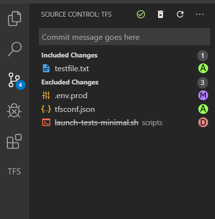

# tfs-scm README

This is an extension to allow VSCode to interact with TFS Source Control using Visual Studio's tf.exe. Highly experimental/incomplete!! This is mostly intended to be used side by side with VS2019 at the moment rather than as a complete replacement.

## Install

1. Download a .vsix from the releases\ folder
2. Press ctrl-shift-p to bring up the command palette and select "install from VSIX"

3. Update the extension settings to point to the correct tf.exe path (if different from default folder)

## Features

### Pending change list

See and modify pending changes

### Quick Diff

### View workspace Info

### Context menu options for Add/Delete/Undo/Get

## Requirements

Must have a local copy of TF.exe installed from Visual Studio. This is _not_ included. This has only been tested against VS2019.

## Extension Settings

This extension contributes the following settings:

`tfsSCM.tfsPath`: Path to the TFS command line client (tf.exe). This must be set!

## Known Issues

* Windows only at the moment.
* No git support -- TFVC only (VSCode git support is already great!)
* Branch/merge is not yet implemented
* Creating workspace mappings is not yet implemented -- view only

## Release Notes

### 0.3.2
* Fix issue where checkin would sometimes error because of missing UI info.

### 0.3.1
* Only checkout files in SCM.

### 0.3.0
* Ask for checkout if read-only file is modified and is in TFS

### 0.2.0
* Icons for renames and rename-edits

### 0.1.0
* Support for checkins

### 0.0.12
* Fix multiple roots sometimes matching
* Fix diff names being too long

### 0.0.11
* Fix high resource usage on large amounts of files being generated/deleted/updated

### 0.0.10
* Added a hack to make checkout on save work again.

### 0.0.9
* Switch to webpack to make extension smaller/faster

### 0.0.8
* Don't show TFS mappings not relevant to current workspace

### 0.0.7
* Much better support for multiple workspaces open at once, with multiple mappings per workspace.

### 0.0.6
* For pending changes, implement include-all and exclude-all, along with discard

### 0.0.5
* Icon sizing

### 0.0.4
* Auto register as TFS SCM

### 0.0.3

* Fix status icons for pending changes
* Implement viewing workspace tree

### 0.0.2

* Placed on github! Does some things.
